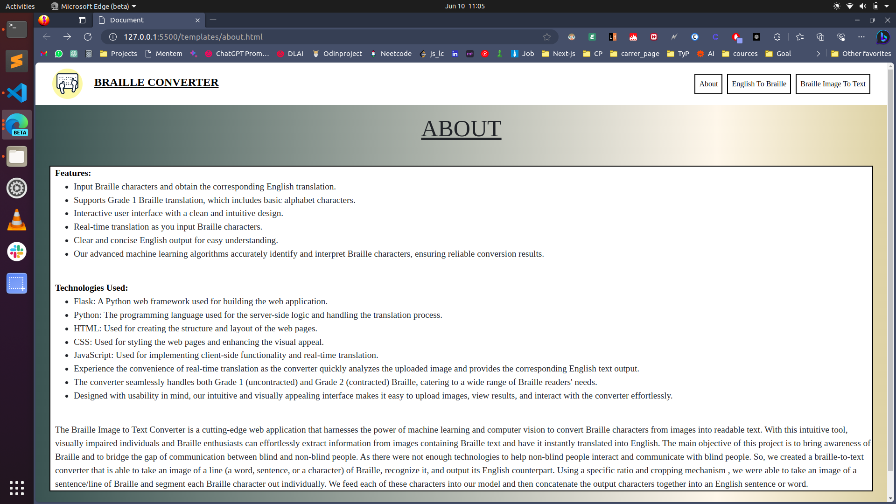

# Braille2English Translator 📖🔠

This project is a web application that translates Braille text into English. It utilizes Flask, Python, HTML, CSS, and JavaScript to provide a user-friendly interface for translating Braille characters into their corresponding English alphabet. ✨

***

***

***

***

## Features ✨

- Input Braille characters and obtain the corresponding English translation.
- Supports Grade 1 Braille translation, which includes basic alphabet characters.
- Interactive user interface with a clean and intuitive design. 🌈
- Real-time translation as you input Braille characters.
- Clear and concise English output for easy understanding.

## Technologies Used 🚀

The project is developed using the following technologies:

- Flask: A Python web framework used for building the web application.
- Python: The programming language used for the server-side logic and handling the translation process.
- HTML: Used for creating the structure and layout of the web pages.
- CSS: Used for styling the web pages and enhancing the visual appeal. ✨
- JavaScript: Used for implementing client-side functionality and real-time translation.

## Installation ⚙️

To run the Braille2English Translator locally, please follow these steps:

1. Clone the repository: `git clone https://github.com/your-username/braille-to-english.git`
2. Navigate to the project directory: `cd braille-to-english`
3. Create a virtual environment (optional): `python -m venv venv`
4. Activate the virtual environment (optional):
   - For Windows: `venv\Scripts\activate`
   - For Unix/Linux: `source venv/bin/activate`
5. Install the required dependencies: `pip install -r requirements.txt`
6. Start the Flask development server: `python app.py`
7. Open your web browser and visit `http://localhost:5000` to access the application.

## Usage 🖥️

1. Upon opening the application in your web browser, you will see an input field where you can enter Braille characters.
2. Input the Braille characters you want to translate into English.
3. The translation will be displayed in real-time as you type.
4. The translated English text will be shown below the input field.
5. To clear the input and output, click the "Clear" button.

## Contributing 🤝

Contributions to this project are welcome. If you find any issues or have suggestions for improvements, please submit an issue or create a pull request in the GitHub repository.

## License 📜

This project is licensed under the [MIT License](LICENSE).

## Contact 📧

For any questions or inquiries, please contact [j.kamlesh8102@gmail.com](mailto:j.kamlesh8102@gmail.com).

Feel free to explore and use this Braille2English Translator. We hope it proves to be a helpful tool for your Braille translation needs! ✨
